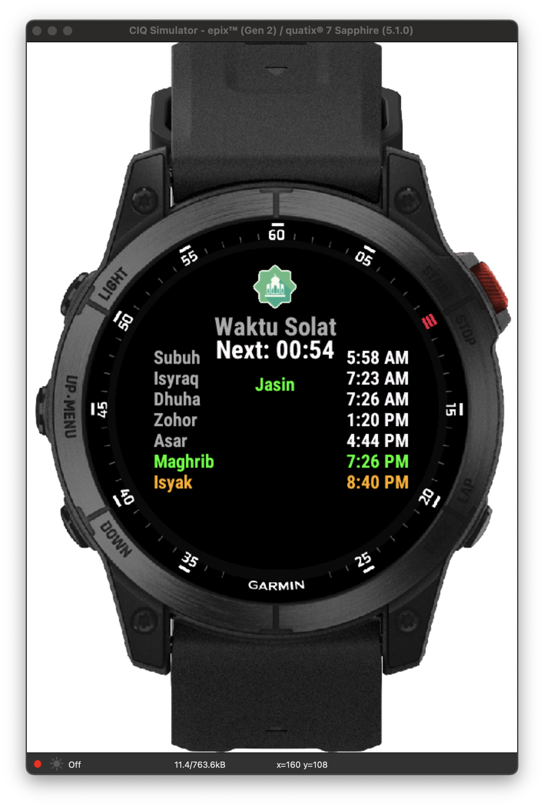
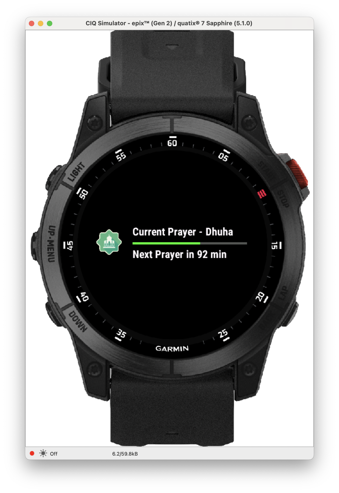

# 🕌 Waktu Solat ConnectIQ App

> **A simple Islamic prayer times app for Garmin watches**

[](https://github.com/salihinsaealal/waktu-solat-connectiq)
[](https://developer.garmin.com/connect-iq/)
[](LICENSE)

## 📱 Screenshots

<div align="center">

### Main App View


### Glance View


</div>

> **Note**: This app currently uses mock prayer times for testing. We plan to add automatic prayer time fetching from API in future updates.

---

## ✨ What This App Does

### 🎯 **Main App**
- **🖼️ Logo at the top** - Shows the app icon
- **⏰ Time countdown** - Shows how much time left until next prayer (HH:MM format)
- **📍 Location** - Shows your location (currently shows "Jasin")
- **🕐 Prayer times** - All times shown in 12-hour format with AM/PM
- **🎨 Color coding** - Easy to see which prayer is which
  - 🟢 **Green**: The prayer time you're in now
  - 🟡 **Yellow**: The next prayer coming up
  - ⚪ **Gray**: Other prayer times
- **📜 Scroll to see all** - You can scroll up and down to see all prayers
- **🎛️ Simple design** - Clean and easy to read

### 📱 **Glance Menu**
- **📊 Progress bar** - Shows how much time has passed
- **⏱️ Quick info** - Shows current prayer and time left
- **🔄 Always updated** - Works together with the main app

### 🕌 **Prayer Times Included**
1. **Subuh** (Fajr) - Dawn prayer
2. **Isyraq** - Sunrise prayer
3. **Dhuha** - Mid-morning prayer
4. **Zohor** (Dhuhr) - Midday prayer
5. **Asar** (Asr) - Afternoon prayer
6. **Maghrib** - Sunset prayer
7. **Isyak** (Isha) - Night prayer

---

## 🚀 How to Use This App

### What You Need
- **Garmin ConnectIQ SDK** - Download from Garmin website
- **Compatible Garmin watch** - Tested on epix2
- **Developer key** - For building the app

### Steps to Install

1. **Download the code**
   ```bash
   git clone https://github.com/salihinsaealal/waktu-solat-connectiq.git
   cd waktu-solat-connectiq
   ```

2. **Build the app**
   ```bash
   monkeyc -f monkey.jungle -d epix2 -o bin/waktu_solat.prg -y developer_key
   ```

3. **Put it on your watch**
   ```bash
   monkeydo bin/waktu_solat.prg epix2
   ```

## ⚠️ Important Note

This app currently uses **test prayer times** that don't change based on your location or date. The times are set for testing purposes only.

**Future plans:**
- Add real prayer time calculation
- Get prayer times from online API
- Use your GPS location
- Update times automatically

---

## 🎨 Customization

> **Want to customize the app?** Check out our comprehensive [**CUSTOMIZATION_GUIDE.md**](CUSTOMIZATION_GUIDE.md)

### Quick Customizations

#### 🎯 **Change Prayer Times**
Edit the mock data in `/source/waktuSolatHomeAssistantView.mc`:
```monkey-c
_prayerTimes = {
    "Subuh" => "05:58",    // Change to your local times
    "Isyraq" => "07:23",
    "Dhuha" => "07:26",
    // ... etc
};
```

#### 📍 **Change Location**
Update the location in the same file:
```monkey-c
_location = "Jasin";  // Change to your city
```

#### 🎨 **Adjust Colors**
Modify prayer colors in the drawing section:
```monkey-c
prayerColor = Graphics.COLOR_GREEN;  // Current prayer
prayerColor = Graphics.COLOR_YELLOW; // Next prayer
```

---

## 📁 Project Structure

```
waktuSolatHomeAssistant/
├── 📄 README.md                    # This file
├── 📄 CUSTOMIZATION_GUIDE.md       # Detailed customization guide
├── 📄 .gitignore                   # Git ignore rules
├── 📄 manifest.xml                 # App manifest
├── 📄 monkey.jungle                # Build configuration
├── 📂 source/                      # Source code
│   ├── 📄 waktuSolatHomeAssistantApp.mc      # Main app class
│   ├── 📄 waktuSolatHomeAssistantView.mc     # Main view (UI)
│   ├── 📄 waktuSolatHomeAssistantDelegate.mc # Input handling
│   └── 📄 waktuSolatGlanceView.mc            # Glance view
├── 📂 resources/                   # App resources
│   ├── 📂 drawables/              # Images and icons
│   │   ├── 📄 drawables.xml       # Drawable definitions
│   │   └── 🖼️ waktu_solat_small.png # App logo
│   ├── 📂 layouts/                # UI layouts
│   └── 📂 strings/                # Text resources
└── 📂 bin/                        # Build output (ignored by git)
```

---

## 🛠️ Development

### Building from Source

1. **Install Garmin ConnectIQ SDK**
   - Download from [Garmin Developer Portal](https://developer.garmin.com/connect-iq/sdk/)
   - Follow installation instructions for your OS

2. **Generate Developer Key**
   ```bash
   openssl genrsa -out developer_key 4096
   openssl pkcs8 -topk8 -inform PEM -outform DER -in developer_key -out developer_key.der -nocrypt
   ```

3. **Build Commands**
   ```bash
   # Build for epix2
   monkeyc -f monkey.jungle -d epix2 -o bin/waktu_solat_epix2.prg -y developer_key
   
   # Test on simulator
   monkeydo bin/waktu_solat_epix2.prg epix2
   
   # Build for other devices (replace 'epix2' with target device)
   monkeyc -f monkey.jungle -d vivoactive4 -o bin/waktu_solat_va4.prg -y developer_key
   ```

### Code Architecture

- **📱 Main App (`waktuSolatHomeAssistantApp.mc`)** - App initialization and lifecycle
- **🖥️ Main View (`waktuSolatHomeAssistantView.mc`)** - Primary UI with prayer times
- **🎮 Delegate (`waktuSolatHomeAssistantDelegate.mc`)** - Input handling (scrolling, menu)
- **👁️ Glance View (`waktuSolatGlanceView.mc`)** - Quick glance widget

---

## 🎯 Roadmap

### 🔄 Current Features (v1.0)
- ✅ Mock prayer time data
- ✅ 12-hour time format
- ✅ Color-coded prayer indicators
- ✅ Glance view with progress bar
- ✅ Location display
- ✅ Custom logo integration

### 🚀 Planned Features (v2.0)
- 🔄 **Real Prayer Time Calculation** - GPS-based accurate times
- 🌍 **Multiple Calculation Methods** - MWL, ISNA, Egypt, etc.
- 🔔 **Prayer Notifications** - Customizable alerts
- 🕋 **Qibla Direction** - Compass pointing to Mecca
- 🌙 **Islamic Calendar** - Hijri date display
- ⚙️ **Settings Menu** - User preferences
- 🌐 **Multi-language Support** - Arabic, Malay, English

---

## 🤝 Contributing

We welcome contributions! Here's how you can help:

1. **🍴 Fork the repository**
2. **🌿 Create a feature branch** (`git checkout -b feature/amazing-feature`)
3. **💾 Commit your changes** (`git commit -m 'Add amazing feature'`)
4. **📤 Push to the branch** (`git push origin feature/amazing-feature`)
5. **🔄 Open a Pull Request**

### 📋 Contribution Guidelines
- Follow existing code style and conventions
- Test on multiple devices if possible
- Update documentation for new features
- Add comments for complex logic

---

## 📄 License

This project is licensed under the MIT License - see the [LICENSE](LICENSE) file for details.

---

## 🙏 Acknowledgments

- **🕌 Islamic Community** - For guidance on prayer time requirements
- **⌚ Garmin** - For the ConnectIQ platform
- **👥 Contributors** - Everyone who helped improve this app

---

## 📞 Support

- **🐛 Issues**: [GitHub Issues](https://github.com/salihinsaealal/waktu-solat-connectiq/issues)
- **💬 Discussions**: [GitHub Discussions](https://github.com/salihinsaealal/waktu-solat-connectiq/discussions)
<!-- - **📧 Email**: your-email@example.com -->

---

<div align="center">

**Made with ❤️ for the Muslim community**

*May this app help you maintain your daily prayers* 🤲

[](https://github.com/salihinsaealal/waktu-solat-connectiq)

</div>
